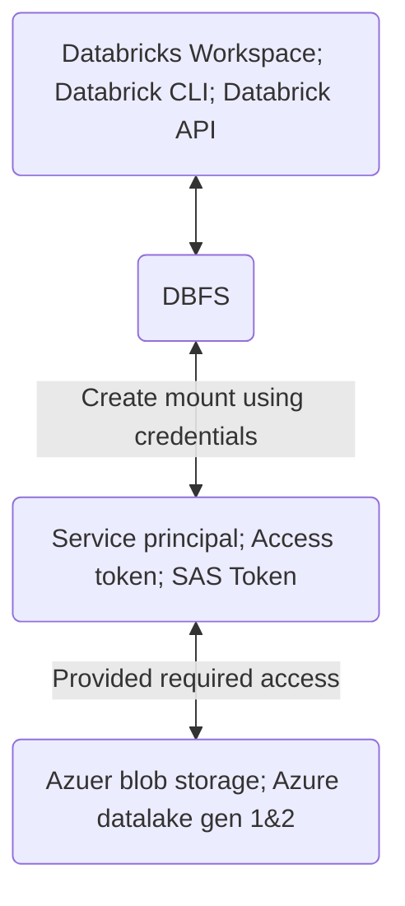

# Introduction to Relational Databases (RDBMS)

This course is a brief intro to RDBMS.

**Table of contents:**

[toc]


# Chapter 1 Fundamental RDBMS concepts


## Review of Data Fundamentals


- types of data
  - Structure: data that follows a rigid format and 
  - Semi-structured: mix of data that has consistent 
  - Unstructured: data that is complex and mostly qualitube information

- data sources
  - relational databases
  - Web scraping
  - Sensor devices 
  - flat files with xml
- **file formats**
  - delimited text files
    - csv, tsv
  - spreadsheets
  - language 
    - Xml, json
    - transfer data
    - platform independent
- **data repositories**
  - it depends on your data time
  - **Online transcation processing system OLTP**
    - designed to store high volume day-to-day operational data
  - Online Analytical Processing systems OLAP
    - optimized for conducting complex data analystics
    - Include relation and non-relations
- relational databases
  - Designed in a way to minimize the duplicaiton of data
  - Example: SQL server, ibm DB2, oracle, mysql


- summary
  - data is information like facts, observation, perceptions, numbers, characters, and images
  - data can be structured, semi-structured


## Information and data models

Outline:

- Differnece between an information model and a data model
- Explain the advantage of the relational model
- Describe the difference between an entity and an attribute


- `Information model`: concept/abstract model for designers and operators
- `data model`:  concrete detaileed model for implementers. It is the blueprint of the system.


- hierachcal model vs relational model
- entity-relationship model 
  - used as a tool to deisgn relational databases
  - building blocks: entities and attributes
  - Example: book is an entity, attributes are its properties (实际上和OOP的概念很相似)

```python
class book()
    def __init__:
    		self.
# year, price, ISBN, pages, Aisle, Description, title, edition
```


> Each entity becomes a table in the database

​	

- [ ] is there a systemtic engineering methodology to design the ERD or OOP to minimize the level of duplication? 


## ERD & Types of Relationship

Outline:

- descibve the building block of a relatin
- explain the symbols used in a relation shipt
- descirnb 1-1, 1-many, many-many 


### Building blocks

- Entities - rectangle
- relationsjhip sets: diamond
- Crows foot notations (in this video)
  - `<` and `>` and `|`


### E-R Diagram (review)


### One-to-one Relationship 


## Mapping Entiteies to tables

**outline:**

- how a E-R translates into a relational diagram


### Example: Entity Book

- Entity = table
- attribute = column


## Data types

Outline:

- explain what data types are
- explain how data types are used in a database 
- identify some common data types


- Character string
  - fixed length `char(10)`
  - variable length varchar(20)
- numeric
  - interger
    - int
    - smallint
    - bigint
  - decimal
    - decimal
    - numceric
    - float
    - single
    - double
- date/time
  - date
    - 2021-12-31
  - time
    - 02.11.35
  - timestamp 
- boolearn
  - 1 bit of information
- binary string
  - a sequence of bytes
- large object **(lob)**
  - Pointer is held in the table while `lob` stays outside since it's too big
- xml


### Advantage of using data types

- Pros:
  - Data integrity (防止非法data entry)
  - Data sorting
  - Range selection
  - Data calculations
  - Use of standard functions


**Summary:**

- data types define the type of data can be stored in a column (保护data integrity)
- it has many other advantages for subsequent operations


## Relational Model

> 这一章其实不错，用linear algebra中的一些矩阵的概念，从数学上来定义这个database的ERD

**Outline:**

- define relational terms (relation, degree, cardinality)


- first proposed in 1970 by E.F. Codd at IBM,  based on mathematical models and terms, click here for the [paper](https://www.seas.upenn.edu/~zives/03f/cis550/codd.pdf)
- 这个数学模型有两个building blocks:
  - `relation`: fancy math term for relation
  - `sets`: 
- `Set`:
  - unordered collection of distinct elements
  - items of the same type
  - no order and no duplicate
- `relational database`: a set of relations
- `relation` = mathematical term for table
- relation分成两个parts `relation schema` and `relation instance`
  - `Relation schema`: specified name of a relation, name and type of each column (attributes)
  - `Relation instance`: a table made up of rows and columns
  - Column = attricutes = field
  - Row = tuple
  - Degree = the numer of attributes (columns) in a relation
  - Cardinality = the numcer of tuples (rows)


Summary

- relational model is based on the `mathmatical concept of relation`
- Relation:
  - mathematical term for table
  - relation schema specifies relation name and attributes
  - relation instance is a table made up of the attributes and tuples
- degree refers to the number of attributes
- cardinality refers to the nuvmer of tuples


# Chapter 2 Introducing Relational Databases Products

This chapter mainly covers the popular databases out there in the industry like `DB2`, `MySQL`,`PostgreSQL` etc


## Database Architecture

**Objective:**

- Describe deployment topologies for databases
- Explain 2-tier and 3-tier architectures including their layers such as database drivers, interfaces and APIs.


### Deployment Topologies - Local

Local/Desktop

- resides on the user's system and access is limited to single user enviromment
- 也叫做single-tier architecture


Application

- Development/testing
- Database embedded in a local application


### Client/server

- Client/server
- database resides on a database server
- Users access database from client system
- sometimes there is a middle-tier (Application Server Layer)
- For multi-user scenerio


拿最近在学的Azure作为例子吧, Azure的DBFS相当于client和server之间的中间层，负责handle这些信息的传输，用户可以从command line, API, Workspace三个地方作为切入口





### Deployment Topologies - Cloud

- Database resides in a cloud environment
- No need to download or install software
- Client access database through an application server layer


### 2-Tier Database Architecture

- Dadabase server可以分成三个abstract部门
  - `Database acess layer` (又分为三个部门)
    - API 常见的data industry APIs 有两种JDBC和ODBC protocal
    - Command Line Processort (CLP) 
  - `Database engine`: compiles queries and retrieves and processes the data and returns the result set.
  - `Datbase storage layer`


### 3-Tier Database Architecture

- In most production environemtn, especially with last 20-25年都是3-tier architecture, 用户不直接和database server对接，通过中间的application server layer


**Summary:**

- Database are deployed in different topologies.
- A single-tier topology is one where the database is installed on a user's local desktop
- In 2-tier database topologies, the database resides on a remote server and users access it from client systems
- In 3-tier database topologies, the database resides on a remote server and users access it through a middle-tier
- In cloud deployments, the database resides in the cloud, and users access it through application server layer or cloud interface


## Distributed Architecture and Clustered Databases

**Keyword**: **`#shared disk distributed database architecture`**, **`#replication`**, **`#parititioning and sharding`**


### Distributed Architectures

- mission critical/large scale workloads 
- High Availability/high scalability requirements
- Databases distributed on a cluster of servers
- Shared disk architecture
  - Share common storage
- Shared nothing architecture
  - Replication
  - Partitioning


### Shared disk architectures

实际上就是一个风险均摊的架构, Shared disk的架构有这样几个好处:

- 一个DB down了，或者hardware failure, 可以直接reroute到另一个用户，不影响client access data
- 还有一个好处，是concurrent design 或者叫parallel design, 这样速度快啊


### Database Replication

在说database replication 之前我们先来说说data replication 

> Data replication is the process of copying data at different physical and virtual location in a manner where each instance of the data is consistent --- increasing availablity and accessibility across networks.

Similarly, DB replication is a process of copying data from a source database to one or more targer databases. 一般常用的方式是通过data manipulation language (DML) to ensure data is consistent across each instance (也就是备份).


具体DML示意图如下，实际上和`git`做version control的格式很像


实现database replication有两个好处

1. 备份在server in the same database center, 防止数据丢失 (obvisously)
2. 备份在别的database center防止power outage, fire, flood or natural disaster

更多细节，[看这里](https://www.striim.com/blog/a-guide-to-modern-database-replication/).

### Paritioning and sharding

- In partitioning, very large tables are split across multiple logical parititions
- In sharding, each partition has its own compute resources


## Database Usage Patterns

**Keyword**: **`#datebase users `**, **`#interfaces and tools`**


 

### DE and Database Admin


### DS and DA


### Application developers and programmers

有两种方法: APIs and ORMs

- **APIS**: REST APIs可能是目前最火的API for working with database
- **Object relational mapping (ORM)** for working with database
  - ActiveRecord for Ruby
  - application Django in Python
  - .NET Hibernate in Java
  - Sequelize in JavaScripts


Summary

- three main claaess of users are
  - DE
  - DA and DS and business analysts
  - Application developers
- Databases can be accessed through
  - graphical and web interfaces
  - command line tools
  - APIs and ORMs
- Major categories of database applications include
  - database management tools
  - data sciewnce and BI tools
  - busienss and industry applications


## Introduction to relational database offerings

**Keyword**: **`#hisotry of relational database `**, **`#popular db`**


- Open-source relational databases
  - MySQL
  - PostgreSQL
  - SQLite


- Cloud databases
  - Driven by move to SaaS model (software as a service)
  - Highly scalable for data analytics
  - Popular 
    - Amazon DynamoDB
    - Amazon Redshift
    - Microsoft Azure Cosmos DB
    - Microsoft Azure SQL DB
    - Google BigQuery


## Db2

- 官方带货


## MySQL


### History

- Developed by MySQL AB, named after developer's daughter
- Sakila the dolphin

- Part of LAMP Stack: linux, apache webserver mysql and php stack. 所以非那时常popular

- Dual licenve
  - GNU GPL
  - commerical license

- object-relational database management system


## PostgreSQL


