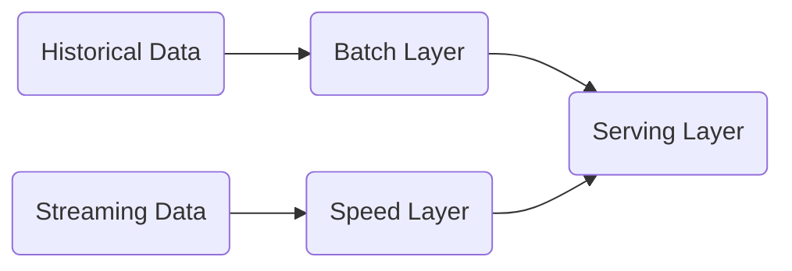

# ETL and ELT Processes

> ETL is a acronym for an automated data pipeline engineering methodology. Here is how [data engineering](https://realpython.com/python-data-engineer/) fit into a business model from real python.

[toc]

## What's ETL

Extraction, transform and load (ETL)  is an automated datapipeline engineering methodology illustrated as 


- Extraction:
  
  - Description: configurng access to data and reading it into an application
  
  - Sources: Various API, web scrapping

- Transformation
  - Descrption: processing data to make it conform to the requirements of both the target system or intended database
  - Sources: 
    - Processing data
    - Conforming to target system or use cases
    - Cleaning
    - Filtering
    - Joining
    - Feature engineering (?)
    - Formatting and data typing (casting etc)
- Load
  - Description: loading data into a new environment such as a database, data warehouse or data mart.
  - Making the data readily available for analytics, dashboards, reports.


**Use cases for ETL pipelines**

- digitizing analog media
- moving data from OLTP systems to OLAP system
- dashboards for sales, marketing


**summary**

- ETL stands for Extract, transform and load

- Extraction means reading data from one or more sources

- Transformation means wrangling data to meet destination requirements

- loading means writing the data to its destination environment

- ETL is used for curating data and making it accessible to end users.

## What's ELT

>  Outline:
> 
> - what it ELT
> - why ELT is an emerging trend?


Cases of ELT:

- d
- d

As for why ELT is an emerging trend:

- ELT separates the data pipeline from the processing
- No information loss
- Cuz cloud platforms are enabling it

## Comparing ETL to ELT

Outline:

- difference between ETL and ELT

Summary:

- incresing demand for access to raw data drives the evolution from ETL to ELT

## Data Extraction Technuqies

Outline

- list examples of raw data sources
- s
- s

examples of raw data sources are:

- paper documents
- web pages
- analog audio/video
- survey, statistics and economics
- transcational data

Techniques for extracting data:

- OCR
- ADC sampling
- CCD sampling
- Mail, phone or in-person
- Web scraping
- APIs 
- database querying
- Edge computing
- biomedical devices that extracting data series

## Intro to data trans techniques

Outline:

- name data transformation techniques
- compare `schema-on-write` vs `schema-on-read`
- list ways info can be lost in transformation

> formatting the data to suit the application

- data typing (casting to apporiate)
- data structuring (json, csv,xml to db table)
- Anonymizing, encrypting
- Cleaning
  - duplicate records, missing values
- normalizing
  - converting data to common units
- filtering
  - sorting, aggregating, binning
- joining data sources

information loss in transformation

- lossy data compression
- filtering
- aggregation
- edge computing devices

Summary:

- ELT for schema-on-read while ETL for schema-on-write

## data loading transformation

outline:

- list data loading techniques
- differentiate batch loading from stream loading
- explain push vs pull
- describe parallel loading

full loading vs incremental loading

scheduled vs on-demand loading

batch vs stream loading vs mini-batch loading

Client-server model

- pull: requests for data originate from the client
- for 
- push:
- for 

# ETL with shell

---

## ETL using shell scripts

Step 1: Create an ETL shell script

```bash
touch Temperature_ETL.sh
gedit Temperature_ETL.sh
#! /bin/bash
# Extract reading with get_temp_API
# Append reading to temperature.log
# Buffer last hour of readings
# Call get_stats.py to aggregate the readings
# Load the stats using load_stats_api
```

Step 2: Schedule it to run every minute

```bash
touch temperature.log
#! /bin/bash
# Extract reading with get_temp_API
# Append reading to temperature.log
get_temp_api >> temperature.log

# Buffer last hour of reading

tail -60 temperature > temperature.log
```

Step 3: ETL scripts transform temperature

`get_stats.py`

- reads temperatures from log file

- calculates temperature stats

- Writes temperature stats to file

- Input/output filenames specified as command line arguments
  
  ```bash
  # Call get_stats.py to aggregate the readings
  ```

python3 get_stats.py temperature.log temp_stats.csv

```bash
Step 4:Load the transformation
```

load the stats using load_stats_api

load_stats_api temp_stats.csv

```bash
Step 5: Schedule ur ETL job
- open crontab `crontab -e`
- enter schedule `1 * * * path/Temperature_ETL.sh`
- close and save
- ur job is now scheduled and running in production

> Summary: You have learnt
> - ETL pipelines can be created with Bash scripts
> - ETL jobs can be run on a schedule using `cron`
```

# Introduction to data pipelines

---

## Brief intro to data pipeline

**Outline:**

- define what a data pipeline is

- describe data pipeline performance with `letency` and `throughout`

- talk about some use cases of data pipelines


> What is a pipeline?
>
> - Series of connected processes
> - output of one process is input of the next
> - 可以用bash command glue those processes


### ETL performance measure latency and throughout

- `data packet`: units of data. 
- `latency`: time it takes for a packet to go through the entire pipeline. 一份单位数据经过整个ETL stages的总时间.  
- `throughout` :  quantify of data can be received within a unit of time. 单位时间内，接受完处理过的数据的量.


**Use cases:**

- bakcing up files (no transformation)

- intefrating disparate raw data sources into a data lake

- streaming data from IoT devices to dashboards

- Preparing ra data for machine learning or production


**Summary:**

In this video, you learned that

- data pipelines move data from one place or form to another

- data flows through pipelines as a series of data packets flowing in and out 1 by 1

- latency and throughput are key design considerations for data pipelines

- data pipelines use cases range from simple copy-and-paste to online video meetings


## Key data pipeline process

**Outline:**

- list key data pipeline processes

- describe data pipeline monitoring considerations

- describe data pipeline solutions for mitigating data flow bottlenecks


**Stages of data processes:**

1. Data extraction
2. data ingestion 
3. transforation stages
4. loading into destination facility
5. Scheduling or triggering
6. Maintenance and Optimization


**Pipeline monitoring considerations:**

1. latency
2. thoroughout
3. Warnings, errors, failures
4. utilization rate 
5. logging and alerting system


**load-balanced and unbalanced pipeline**

下面讲一下`load-balanced pipelines` vs `unbalanced pipeline` 

- 实际上,load-balanced pipeline指的是，在你的ETL pipeline中，每一个stage需要处理数据的时间，都是相等的，自然也不会有bottleneck, 这个idea就像车联网一样，如果汽车全部由计算机在控制，即使开同样的速度，都不会出任何事故. 而这种analogy, 在data pipeline中，也就对应着load-balanced pipeline
- Handling unbalanced loads:
  - Pipelines typically contain bottlenecks
  - Slower stages may be parallelized to speed up throughput
  - Processes can be replicated on myltiple CPUs/cores/threads
  - Data packets are then distributed across these channels
- parallel pipeline 也叫 dynamic pipeline or non-linear pipeline VS static pipeline A.K.A. serial pipeline


**stage synchronization**

- I/O buffers can help synchronize stages
- Holding area for data between processing stages
- Buffers regulate the flow of data, may improve throughput
- I/O buffers used to distribute loads on parallelized stages


**Summary:**

- data pipeline processes include scheduling or triggering, monitoring, maintenance and optimization
- pipeline monitoring - tracking latency, throughput, resource utilization, and failures
- parallelization and I/O buffers can help mitigate bottlenecks


## Batch VS Streaming data pipeline use cases

**Objectives:**

- Differentiate between batch pipelines and streaming data pipelines
- Describe micro-batvh and hybrid lambda data pipeline (hybrid $\lambda$ ?)
- List use cases for batch data pipelines
- List use cases for streaming data pipelines


### Batch data pipeline

- Operate on batches of data
- Run periodically - hours, days, weeks apart
- Can be initiated based on data size or other triggers
- When latest data isn't needed
- Typical choice when accuracy is critical


### Streaming data pipeline

- Ingest data packets in rapid succession
- For real-time results
- Records/events processed as they happen
- Event streams can be loaded to storage
- Users publish/subscribe to event streams


### Micro-batch data pipelines

- tiny micro-batches and faster processing simulate real-time processing
- smaller batches improve load balancing lower latency
- when short windows of data are required during transformation


### Batch vs stream requirements

- trade-off between accuracy and latency requirements
- data cleaning improves quality, but increases latency
- lowering latency increases potential for errors


### Lambda architecture

> lambda architecture: combination of both batch and stream 



- data stream fills in "latency gap"
- Used when data window is needed but speed is also critical
- drawback is logical complexity (结构太复杂了)
- lambda architecture = accuracy and speed (只有在设计需求，同时需要accuracy和速度时，可以用lambda)


Batch pipeline use cases

- periodic data backup
- transcation history loading
- billing and order processing
- data modelling on slowly varying data
- mid to long term sales or weather forecasting
- retrospective analysis (数据回溯)
- Diagnostic mediacal image processing 


Streaming use cases:

- watching movies, listening to music or podcasts
- social media feeds, sentiment analysis
- Fraud detection
- User behavior, advertising
- Stock market trading
- Real-time product pricing
- Recommender systems


|          | Batch Pipeline                                               | Streaming Pipeline                                           |
| -------- | ------------------------------------------------------------ | ------------------------------------------------------------ |
| 特点     | 在一整个batch of data一起操作, 对于精度要求高但不要求实时的应用比较合适 | 把一个batch of data分成很多小块，ingest 1-by-1 quickly. 适合于对实时性要求高的应用 |
| 应用场景 | 数据回溯，定期data back-up, 长期的销售预测                   | fraud detection, 听歌看netflix                               |


## Data Pipeline Tools and Technologies

**Objective:**

- discuss data pipeline technologies
- list open source and enterprise ETL and ELT tools
- list streaming data pipeline tools


商业级data pipeline features:

- **Automation**: fully automated pipelines
- **Ease of Use**: ETK rule recommendations
- **Drag-and-drop interface**: "no-code rules" and data flows
- **Transformation support**: Assistance with complex calculations
- **Security and compliance**: data encryption and compliance with HIPAA and GDPR.


### open source data pipeline tools

#### open-source: Pandas

- Pandas
  - Pro:
    - based on data frames for table-like structures
    - great for ETL, data exploration, prototyping
  - Con:
    - Doesn't readily scale to big data
- Libraies with similar API help with scaling up: Vaex, Dask, and Spark help with scaling up
- Consider SQL-like alternatives such as PostgreSQL for big data applications.


#### open-source: Apache airflow

Now, we look at another open-source tool: Apache airflow


Some features:

- versatile "configuration" as code data pipeline platform
- Open-sourced by airbnb
- programmatically author, schedule and monitor workflows
- scales to big data
- **integrates with cloud platforms such as** AWS, IBM, GOOGLE CLOUD or Azure


#### open-source: talend

Some JD also hires ppl who used JD b4.

- supports big data, data warehousing and profiling
- includes collaboration, monitoring and scheduling
- Drag-and-drop GUI allows you to create ETL pipelines
- Automatically generates Java code
- Integrates with many data warehouse


### Enterprise data pipeline tools

#### AWS Glue

- ETL service that simplifies data prep for analytics
- Suggests schemas for storing your data
- Create ETL jobs from the AWS console

#### Panoply

- An ELT-specific platform
- No-code data integration
- SQL-based view creation
- Shifts emphasis from data pipeline development to data analytics
- Integrates with dashboard and BI tools such as tableau and PowerBI

#### Alteryx

- Self-service data analytics platform
- Drag-and-drop accessibility to ETL tools
- No SQL or coding required

#### IBM InforSphere

- A data integration tool for designing, developing and running ETL and ELT jobs
- the data integration component of the IBM InforSphere Information Server
- Drag-and-drop graphical interface
- Uses parallel processing and enterprise connectivity in a highly scalable platform


### streaming data pipeline tools

#### IBM Streams

- build realtime analytical application using SPL, plus java, python and c++
- Combine data in motion and at rest to deliver intelligence in real-time
- achieve end-to-end processing with sub-millisecond latency
- Includes IBM streams flows, a drag-and-drop interface for building workflows


#### Others streaming

- apache storm, sqlstream, samza, apache spark, azure stream analytics, Kafka


**Summary:**

- modern data pipeline technologies include schema and transformation support, drag-and-drop GUIs, and security features.
- Pandas is an open-source Python libraries for prototyping and building data pipelines
- Apache airflow and talent open studio allow you to programatically autho, schdule and monitor big data workflows
- Panoply is specific to ELT pipelines
- Alteryx and IBM infosphere data stage can handle both ELT and ETL
- Stream-processing technologies include Apache Kafka, IBM Streams, and SQLstream


# Apache airflow tutorial

Apache Airflow's main advantage is representing data pipelines as `DAGS` expressed as code, which makes the data pipeline more maintainable, testable, and collaboeative. 

> Tasks: it is the nodes in a DAG, are created by implementing Airflow's built-in operators.


## Apache Airflow Overview


### What is Apache Airflow

- An open-source workflow orchestration tool 
- A platform that lets you build and run workflows
- A workflow is represented as a DAG (directly acyclic graph)
- It is work flow manager not a streming solution.


### Apache Airflow Features

Simplified view of Airflow's architecture is shown in the image below:


- `Metadata Database`: Airflow holds a Metadata Database, which is used by the Scheduler, Executor, and the Web Server to **store the state of each DAG and its tasks** (和SQL中的metadata一样，只记录了数据库宏观的一些表征).
- `Scheduler`: Airflow has its **built-in scheduler**, handling the triggering of all scheduled work flows. It is responsible for submitting individual tasks from each scheduled workflow to the Executor.
- `Executor`: handles the running of these tasks by assigning them to workers, which run the tasks. 也就是包工头.
- `Web Server`: serves airflow's powerful interactive user interface.
- `User interface`: allows user to inspect, trigger and debug any of your DAG files and their individual tasks.
- `DAG Directory`: contains all of your DAG files, ready to be accessed by the Scheduler, the Executer, each of its employed Worker.


Sample DAG illustrating the labeling of different branches:


If no errors, then 自动生成报表的体系 else email报错.


### Lifecycle of an Airflow

The lifecycle of an Apache Airflow task state:


一个成功的Airflow的流程, 是from no status to scheduled, queued, running, success. 当然也有capture failed airflow的mechanism


### Airflow main features

**Some main features:**

- pure python
  - flexibility
- Useful UI
  - Full insight into status
- Integration
  - plug and play with let's say IBM
- Easy to use
  - if you know python, you can
- Open source
  - community of developers


**Airflow pipelines are built on four principles:**

- Scalable
  - modular architecture uses a orchestration
- Dynamic
  - dynamic pipeline generatorion in python
- Extensible
  - extend to more libraries to serve your application
- Lean
  - jinja templating engine


### Apache Airflow use cases

- `sift`: defining and organizing machine learning pipeline dependencies
- `seniorlink`: increasing the visibility of batch processes and decoupling them
- `experity`: deploying as an enterprise scheduling tool
- `onefootball`: orchestrating SQL transformations in data warehouses


## Why DAGs>

Outline:

- what a DAG is?
- Describe worksflows as DAGs of tasks and dependencies
- Outline the components of a DAG definition file
- Describe how **scheduler executes tasks** on an array of workers 
- List key pros of defining workflows as code


### What is a DAG?

The best explanation could be found [here](https://www.youtube.com/watch?v=1Yh5S-S6wsI).

- Direct (D): it has a certain direction
- Acyclic (A): it doesn't form a cycle so it doesn't flow back
- Graph (G): graph containing node and edges.


In Airflow:

- Nodes are tasks.
- Edges are dependencies, the sequence it should run
- `Tasks`: tasks are writtening in python and tasks implement operators, for example, python, SQL, or Bash operators
- `Operators`: determine what each task does, 比如
  - `sensor operator`: poll for a certain time or condition. 比如每过30min去check一下文件是否存在啊.
  - `other operators`: include email and HTTP request operators.


### DAG definition components

A typical DAG python script consists of:

- Library imports
- DAG arguments
  - DAG Argument expressed with a `dictionary`
- DAG definition
  - definition or instantiation block for DAG
- Task definitions
- Task pipeline
  - define the dependency `task1 >> task2`


```python
# library imports 导入库

from datetime import datetime, timedelta
from textwrap import dedent

# The DAG object; we'll need this to instantiate a DAG
from airflow import DAG

# Operators; we need this to operate!
from airflow.operators.bash import BashOperator

# DAG definition or instantiation (这里把DAG argument nested in了)
with DAG(
    'tutorial',
    # These args will get passed on to each operator
    # You can override them on a per-task basis during operator initialization
  # DAG argument
    default_args={
        'depends_on_past': False,
        'email': ['airflow@example.com'],
        'email_on_failure': False,
        'email_on_retry': False,
        'retries': 1,
        'retry_delay': timedelta(minutes=5),
        # 'queue': 'bash_queue',
        # 'pool': 'backfill',
        # 'priority_weight': 10,
        # 'end_date': datetime(2016, 1, 1),
        # 'wait_for_downstream': False,
        # 'sla': timedelta(hours=2),
        # 'execution_timeout': timedelta(seconds=300),
        # 'on_failure_callback': some_function,
        # 'on_success_callback': some_other_function,
        # 'on_retry_callback': another_function,
        # 'sla_miss_callback': yet_another_function,
        # 'trigger_rule': 'all_success'
    },
    description='A simple tutorial DAG',
    schedule=timedelta(days=1),
    start_date=datetime(2021, 1, 1),
    catchup=False,
    tags=['example'],
) as dag:

    # t1, t2 and t3 are examples of tasks created by instantiating operators
    # Task defintition 记住task implement operator, and operator could be python, bash or SQL.
    t1 = BashOperator(
        task_id='print_date',
        bash_command='date',
    )

    t2 = BashOperator(
        task_id='sleep',
        depends_on_past=False,
        bash_command='sleep 5',
        retries=3,
    )
    t1.doc_md = dedent(
        """\
    #### Task Documentation
    You can document your task using the attributes `doc_md` (markdown),
    `doc` (plain text), `doc_rst`, `doc_json`, `doc_yaml` which gets
    rendered in the UI's Task Instance Details page.
    
    **Image Credit:** Randall Munroe, [XKCD](https://xkcd.com/license.html)
    """
    )

    dag.doc_md = __doc__  # providing that you have a docstring at the beginning of the DAG; OR
    dag.doc_md = """
    This is a documentation placed anywhere
    """  # otherwise, type it like this
    templated_command = dedent(
        """
    
        echo "{{ ds }}"
        echo "{{ macros.ds_add(ds, 7)}}"
    
    """
    )

    t3 = BashOperator(
        task_id='templated',
        depends_on_past=False,
        bash_command=templated_command,
    )
		
    # task pipeline 也就是决定DAG的dependencies
    t1 >> [t2, t3]
```


当你写完你所有的DAG files, airflow scheduler会根据你在DAG中specify的dependencies和时间来做运作.

> Airflow Schduler then schdules and depolys ur DAG files.

It is defined as code with the following advantage:

- Maintainable
- Versionable
  - with `git`
- collarborative
- Testable
  - unit test for rech revision


Some excellent material

- read their official [help documentation](https://airflow.apache.org/docs/apache-airflow/stable/index.html)


## Airflow monitoring and Logging

Objective:

- use logging capabilities to monitor the task status and diagnose problems with DAG runs
- Explain accessing emitted metrics such as counters, gauges, and timers.

### Logging


log file is organized by both dag and task id.


### Monitoring metrics

自带提供三种monitoring metrics:

- `Counter`: Metrics that always increase
  - total count of task instances failures
  - total count of task instances successes
- `Gauges`: metrics that may **fluctuate**
  - number of running tasks
  - DAG bag size, or number of DAGs in production
- `Timers`: Metrics related to time duration
  - miliseconds to finish a task
  - miliseconds to reach a success or failed state


**Summary**:

- You can save airflow logs into local files systems and send them to cloud storage, search engine, and log analyzers
- Airflow recommends sending production deployment logs to be analyzed by [Elasticsearch](https://www.elastic.co) or Splunk
  - Old [security information and event management (SIEM)](https://en.wikipedia.org/wiki/Security_information_and_event_management) is part of the data security ecosystem. SIEM is a data aggregator, search and reporting system. Its main functions are [reporting and forensic](https://www.varonis.com/blog/what-is-siem) about security incidents and alerts based on analytics that match a certain rule set, including a security issue. It is used to be on-premises (Splunk, IBM QRadar, LogRhythm) and now moved to fully on cloud, let's say Elasticsearch
- Three types of Airflow metrics are counters, gauges, and timers
- Airflow recommends that production deployment metrics be sent to and analyzed by Prometheus via StatsD


## Airflow hands-on lab 

### Step 1 set up

In this section it covers basic step for setting up in 

This is a follow-along for a youtube tutorial and another excellent [medium walk-through](https://towardsdatascience.com/a-complete-introduction-to-apache-airflow-b7e238a33df) on apache airflow.

- `export AIRFLOW_HOME=.`: export airflow directory home environment to the current directory `.` or you can create a `.env` file by `echo "AIRFLOW_HOME=${PWD}/airflow" >> .env`

- `airflow db init`: initialize a `sqlite` database as backend. It is recommended by apache airflow not to user `sqlite` in production. For more info, [refers here](https://airflow.apache.org/docs/apache-airflow/2.4.2/howto/set-up-database.html). After this step, you should be able to see this.

- `airflow webserver -p 8080` : open a webserver
- `airflow users create --help`: to create a user with admin role. On mac, make sure you just put `sudo` before anything
- `airflow scheduler`: open the scheduler. 


# Apache Kafka Tutorial

Learning Objectives:

- List main components of an ESP
- Explain how Apache Kafka functions as an Event Streaming Platform (ESP)
- List popular Kafka-based ESP-as-a-Service providers

## Distributed Event Streaming Platform (ESP)

**Outline**:

- Descrive what an event is 
- List the common event formats


### What is an event?

- `EVENT`: describe an entity's observable state updates over time
  - Example: GPS coordinates of a car, temperature of a room
  - Analogy, it is essential the total derivative of a variable.

$$
d\vec{V}=\frac{\partial \vec{V}}{\partial t}dt + \frac{\partial \vec{V}}{\partial x}dx + \frac{\partial \vec{V}}{\partial y}dy + \frac{\partial \vec{V}}{\partial z}dz
$$

Where $\vec{V} = \vec{V}(t,x,y,z)$


### Common Event Formats

- Primitive datatype
  - `"HELLO"`
- A key-value pair
  - Key:
  - Value:
- A key-value pair with a timestamp
  - Key:
  - Value:
  - timestamp:
- More complex datatype: tuple, list, JOSN, XML


### Event streaming

Event steaming from one event source to one destination. 就比如GEOTAB或者t-box就需要实时传输, 做一下. The figure below shows a 1-1 event streaming.


Event streaming传到云端，我再通过API来看.

In reality, evenIt is generally harder with

- streaming **multiple different sources** simultaneously and each event source could **have different protocol (JDBC, HTTP)**
- sometimes, a event destination serves both as a desitination and a source 

The problem is illustrate in the figure below


为了解决上述这些问题, event streaming platform (ESP) becomes a solution. ESP相当于中间的relay, 来承接上游信号，而下游只需要和ESP做接口就可以了.

An architecture for EVP is shown in the figure below


### ESP main components

基于不同ESP产品，往往有很多不同的组件，但是Main components of ESP (至少是功能-wise)有三个, they are

- `Event Broker`:

- `Event Storage`
- `Analytic and Query Engine`


For event broker,


### Popular ESPs

- Amazon Kinesis, Apache Flink, **Apache Kafka**, Apache Spark, Apache Storm etc
- Apache kafka is the most popular one (until 2020, what abour 2022)


## Apache Kafka Overview

Objective:

- recognize apache kafka as an event streaming platform
- describe the architecture of Apache Kafka
- List common use cases for Apache Kafka
- Summarize the main features and benifits of Apache Kafka
- List popular ESP-as-a-Service providers


The main application of kafka is illustrated in the figure below


Some upstream are:

- `User Activities`: where user click, look or hover longer etc. 最早kafka在收集用户数据的应用占大多数
- `Metrics`: event such as GPS, sensor etc. 之后逐渐向这个方向靠拢.


### Kafka architecture

Architecture


Main features of Apache Kafka:

- Distribution system
- Highly scalable
- Highly reliable
- Permanent persistency
- Open source


### Event streaming platform as a service

Some commercial used Apache Kafka 

- confluent cloud, IB, event streams, amazons MSK


## Building ES pipelines using Kafka

Objectives:


### Broker and topic

- broker: 
- Zoo-keeper


Partition and replications? 这是啥意思


### Kafka topic CLI


### Kafka producer


### Kafka consumer

kafka consumers

- consumers are clients subscribed to topics
- consume data in the same order
- store an offset record for each partition
- offset can be reset to zero to read all events from the beginning again


### An example

The main workflow for a Kafka is illustrated in the picture below


实际上这个project就很像我需要的一个profolio project. It would be awesome if i do something like that.


**Summary:**

- The core componts of kafka are
  - `brokers`: The dedicated servers to receive, store, process, and distribute events.
  - `Topics`: The containers or databases of events
  - `Partitions`: Divide topics into different brokers
  - `Replications`: Duplicate partitions into different brokers
  - `Producers`: Kafka client applications to publish events into topics
  - `Consumers`: kafka client application are subscribed to topics and read events from them
- The kafka-topics CLI manages topics
- The kafka-console-producer CLI manages producers
- The kakka-console-consumer manages consumers 


## Kafka streaming process

Outline:


