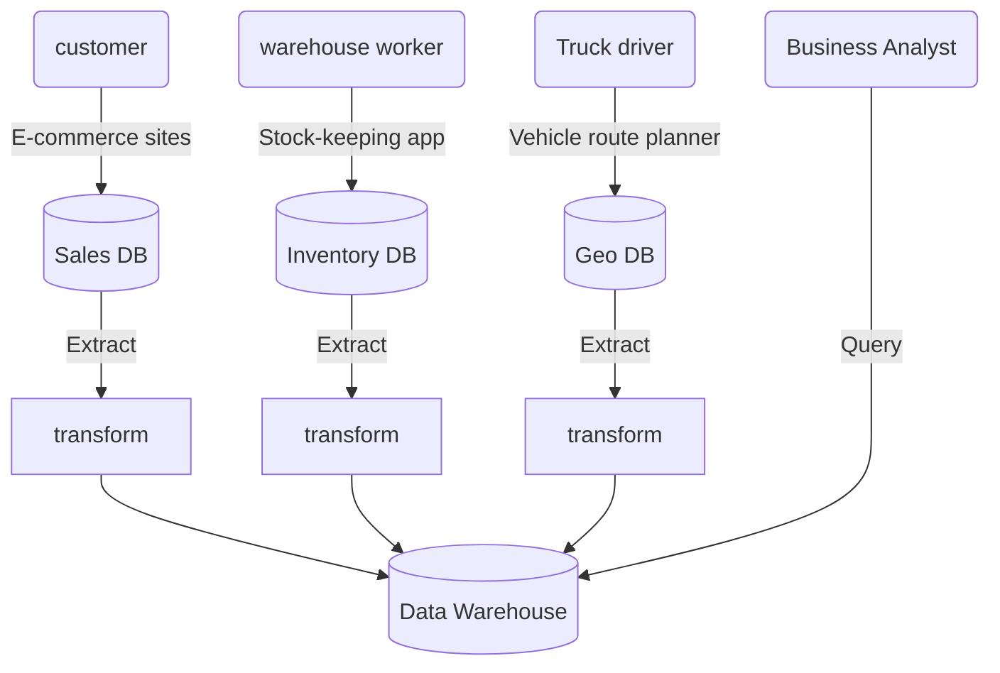

# Designing Data-intensive Applications

> General purpose of the book is to give you an idea.  


[toc]


Some words

- published in 2014, but still good since AWS out there since 2008.

- reduce the risk of **vendor lock-in**

- High level of understanding of the big picture, and why we choose one over another


# Chapter 1. The Big Picture


# Chapter 2. The Battle of the Data Model

> The limits of my language mean the limits of my world.

Data model是软件设计中重要的一环，咋样fulfill上一张的那些软件开发的一些原则，比较neat的solution是一层一层的封装, layer of layer of abstraction, example 如下:


## 2.1 Rivals of the Relational Model

乱成贼子noSQL, 带着document-based database为武器，准备颠覆几十年的relational database的王朝.

| Property                      | SQL database                                                 | NoSQL database                                              |
| ----------------------------- | ------------------------------------------------------------ | ----------------------------------------------------------- |
| Data model                    | relational                                                   | Non-realational                                             |
| Structure                     | Table-based, with columns and rows                           | Document based, key-value pairs, graph or wide-column       |
| Schema                        | Predifined and strict schemma; datatype is same across each column; | A dynamic schema or schemaless; 数据不需要是相同的data type |
| Query language                | SQL                                                          | dependent on database                                       |
| Scalability                   | vertical scaling                                             | horizontal scaling                                          |
| ACID transactions             | Supported                                                    | suppored, depending on the specific NoSQL database          |
| Ability to add new properties | Need to alter the schema first                               | Possible without disturbing anything                        |
| 一些历史                      | ~1970 IBM engineer proposed it and popularize over next 30 years due to LAMP |                                                             |


### 2.1.1 Object-relational mismatch

> 一般来说,

更好的理解SQL vs noSQL, 我们来用linkedin工程师真实遇到的一个问题作为例子. 你可以从query和储存两个方面来assess能力

|       | SQL                                                          | JSON                                            |
| ----- | ------------------------------------------------------------ | ----------------------------------------------- |
| 储存  | 建立schema麻烦，而且以后增加新的section, 需要新添加和修改你的ERD | tree-like structure, 只需要重新append一下就好了 |
| query | multiple table join!!                                        | just one simple query                           |


同时，你们注意到了region_id, industry_id都是用id而不是用地区名这种string了嘛? 很多申请网站都用dropdown men或者auto completer的设计，可以解决很多问题

- 格式统一，规避spelling and style errors
- 防止重复城市名(waterloo in canada, in states and in UK)
- etc

把entities改成id的这个流程叫做`normalization`, 实际上和machine learning中处理categorical variables的方法是一样的.

### 2.1.2 Many-to-one and many-to-many replationship


### 2.1.3 Historical interlude


### 2.1.4 Relational vs document database today

> 有点outdated since the book published in 2014.


## 2.2 Query Languages for Data


| Property | Declarative query language                                   | Impreative language                                          |
| -------- | ------------------------------------------------------------ | ------------------------------------------------------------ |
| 本质     | 描述你想要的数据, 背后具体怎么完成，由batabase's optimizer来解决这个问题, 不用你操心 | 指令计算机进行一系列操作, declare variables, iteration,输出结果 |
| 例子     | SQL                                                          | python, java                                                 |
|          |                                                              |                                                              |

### 2.2.1 `MapReduce` Query

Mapreduce 是一种programming model for processing large amount of data in bulk across many machines, popularized by Google.

它介于impreative和declarative language中间, 它是基于很多languages中都有的built-in functions, `map` (or collect) and `reduce` (fold or inject).

举一个例子，如果你是一个海洋学家，你在海上每看到一只动物你就记录下来你看到的信息以及看到的时间，现在你需要query 你每个月能看到多少种Lamniformes鲨鱼

```sql
SELECT
		DATE_TRUNC('month',observation_timestamp) AS observation_month,
		SUM(num_animals) AS total_animals
FROM
		observations
WHERE family = 'Lamniformes'
GROUP BY observation_month;
```


## 2.3 Graph-like Data Models

 比较一下document model, 如果你的应用场景主要是one-to-many relationships (tree-structured data) or no relationships between records, the document model is appropriate.

如果你的数据里many-to-many relationship很常见的话，你需要用graph来model你的data了.

下面是一张采用的data model和数据的level of connectiveness之间的关系


当数据之间的联系复杂到一定程度的时候，一般就用graph来做储存了. 


# Chapter 3. Storage and Retrieval


## 3.1 Data Structure that power your database

数据结构这块实在不懂，跳过暂时

### 3.1.1 Hash indexes

`Key-value` stores are quite similar to the dictionary type that you could find in many programming langugae and it's implemented as a `hash map` (or hash table.)


现在还不会hash map, 看这一章有些费力. 


### 3.1.2 SSTables and LSM-Tree

 


## 3.2 Transcation Processing or Analytics

​	 这一章主要围绕着`OLAP`和`OLTP`这两个概念来讨论它们的区别，相似处和为什么这么命名。The boundary between OLAP and OLTP isn't clear-cut tho.

| Property          | OLTP                                             | OLAP                                      |
| ----------------- | ------------------------------------------------ | ----------------------------------------- |
| Name              | Online transcation processing                    | Online analytic processing                |
| Main read pattern | Small number of records per query fetched by key | Bulk import (ETL) or event stream         |
| 例子              | actions in a game, comments on blog posts        |                                           |
| Primarily used by | End user/customer, via web application           | Internal analyst, BI team                 |
| 数据代表着什么    | Latest state of data                             | History of events that happened over time |
| Dataset size      | Gigabyte - terabyte                              | Terabyte - petabyte                       |

一开始, OLTP和OLAP是用同一种数据库的，但是随着时间的流逝,, in early 1990s, 公司开始用不同的数据库来handle OLTP和OLAP了,这也是数据仓库的起源.

现如今dataware house一般用来储存OLAP的数据，而要和用户进行交互的OLTP, 则需要非常低的latency, 不然就会非常慢，那么BI analyst动不动就提取这么多数据，还要做aggregate, 那会严重影响数据库的速度，如果是multi-users同时access的话，也就会有concurrent issues.

主要的业务逻辑如下图，假设你的公司有很多小的OLTP比如sales, inventory, Geo这三个分别用三个data warehouse来储存和处理，最后统一通过ETL batch processing进入到data warehouse中



很多小公司可能就没有这个烦恼，因为没有那么多OLTP的平台，没那么多的数据量要进行处理。


## 3.3 Column-oriented storage

在这一节，你会理解:

- 什么是column-oriented database? 
- 为什么我们要用这项技术
- 


按column的方法储存，是现如今，负责OLAP业务的数据库的常见储存方法，data warehouse中动辄几百行的数据，你如果按row-based进行储存(for both SQL and document-based), 都是极其大的数据量。

> Note: column-oriented storage is simple: don't store all the values from one row together, but store all the values from each column together instead.

举个例子，现在你有100列数据，然后你现在需要提取2003年中，在每个工作日卖出的fresh fruit和candy的数量

```sql
SELECT
		dim_date.weekday,
		dim_product.category,
		SUM(fact_sales.quantity) AS quantity_sold
FROM
		fact_sales
LEFT JOIN dim_date ON fact_sales.date_key = dim_date.date_key
LEFT JOIN dim_product ON fact_sales.product_sk = dim_product.product_sk
WHERE
		dim_date.year = 2013
AND dim_product.category IN ('Fresh fruit', 'Candy')
GROUP BY
		dim_date.weekday, dim_product.category;
```

查询的结果大致如下:

| weekday   | category    | Quantity_sold |
| --------- | ----------- | ------------- |
| Monday    | fresh fruit | 23100         |
|           | Candy       | 20982         |
| Tuesday   | fresh fruit | 21424         |
|           | Candy       | 12453         |
| Wednesday | fresh fruit | 35432         |
|           | Candy       | 32423         |
| Thursday  | fresh fruit | 34234         |
|           | Candy       | 65776         |
| Friday    | fresh fruit | 43535         |
|           | Candy       | 76853         |

如果这个OLAP是row-based数据库，然后你的数据有100列, 则你的数据库接到这个declarative language (SQL)的指令后，optimizer会做出:

- load 这100多列from disk into memory (贼慢), 一共三个table
- 先进行`left join`把数据合在一起
- 再进行parse and filter `where` 
- 再做aggregate 

然而你只需要三列的数据，你却需要load, parse, filter 100 多列数据，这就是row-oriented database逐渐got replaced by column-based的原因。

> Tip: 在工作中永远别用`SELECT *` 因为真的很耗时间去读取

现在来举个例子, look the the following table called **fact_sales**

| date_key | product_key | store_key |
| -------- | ----------- | --------- |
| 140102   | 69          | 4         |
| 140102   | 69          | 5         |
| 140102   | 69          | 5         |
| 140102   | 74          | 3         |
| 140103   | 31          | 2         |
| 140103   | 31          | 3         |
| 140103   | 31          | 3         |
| 140103   | 31          | 8         |

按照column-oriented data storage的形式，那么就变成了这样

date_key file contents: 140102, 140102, 140102, 140102, 140103, 140103, 140103, 140103

product_sk file contents: 69, 69, 69, 74, 31, 31, 31, 31

Store_sk file contents: 4, 5, 5, 3, 2, 3, 3 ,8


> Column storage用relational database很容易来理解，但同样也被应用于nosql database, such as `parquet`, which is a columnar storage format for a document data model, based on Google's Dremel.

好的这样我们解决了提取速度的问题，那我们能不能让数据占用的disk空间更小呢?


### 3.3.1 Column compression

那我们还有什么可以优化的呢？那自然是压缩了, 就拿买房的人的数据库, 你现在打开买房人所属国家这一列，你会发现，有大量的重复项(一共就200多国家)。只要有重复项，就存在压缩的可能性，这里介绍其中一种压缩技巧 **bitmap encoding**


这里效果已经很明显了，用zeros, ones, rest zeros这几个来表示，可以极大的压缩数量。

### 3.3.2 Sort order in column storage


### 3.3.3 Writing to column-oriented storage


### 3.3.4 Aggregation: data cubes and materialized views


# Chapter 4 Replication


## 4.1 Shared-Nothing Architectures


